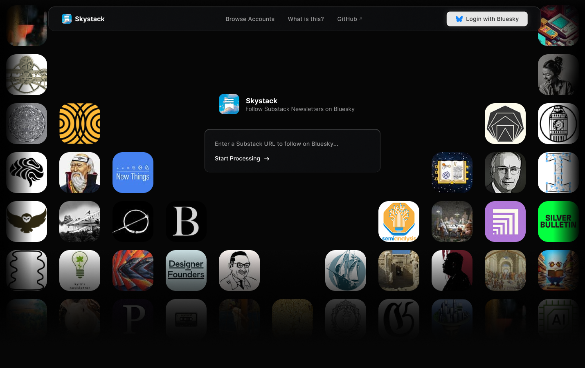

## SkyStack

> [!WARNING]
> Still work in progress. Not ready for use.

Follow Substack newsletters on Bluesky. This repo contains:

-   `app/` — Next.js (App Router) frontend deployed on Vercel
-   `flask/` — Flask backend service designed for Google Cloud Run



### Overview

-   **What it does**: Bridges a Substack publication to a Bluesky account using AT Protocol APIs. It can import recent posts, mirror older posts beyond RSS limits, and capture social graph data to improve discovery.
-   **How it works**:
    -   The Flask service exposes endpoints to create the Bluesky account, import posts, and periodically build updates. It stores metadata in Firebase/Firestore and uses Cloud Tasks for async work.
    -   The Next.js app provides the UI: a hero grid, browse/search, and a dialog that shows the progress of “mirroring” a newsletter.

### Checklist

1. [x] Connect to PDS and implement `createAccount`, `post`, `followUser`, `updateProfile`.
2. [x] Implement Substack Integration
3. [x] Implement RSS Check Cron Jobs, Background post imports
4. [x] Create Skystack Web App
5. [ ] List all mirrored accounts from firestore as static json for search (Currently using mock data)
6. [ ] Connect `createNewsletter` to UI
7. [ ] Import Newsletter Social Graphs, create Cloud Task endpoint for background import

### Future

1. [ ] Login with Bluesky
2. [ ] Implement PDS on GCP Cloud Run using snarfed/arroba instead of VM-based implementation of atproto/pds
3. [ ] Increase posts mirrored limit from 50 to unlimited
4. [ ] Implement Substack Notes support as well
5. [ ] Expand horizon beyond Substack to all blogs? (Not just what's present in RSS Feed, even older posts)

### Quick start

1. Backend (Flask)

```bash
cd flask
python3 -m venv .venv
source .venv/bin/activate
pip install -r requirements.txt

# Copy `.env.example` to `.env`:
cp .env.example .env

# Run locally (port 8080)
python app.py
```

2. Frontend (Next.js)

```bash
cd app
npm install
npm run dev
# open http://localhost:3000
```

Note: The current UI ships with a simulated progress stream. See `app/README.md` for how to wire the UI to the Flask `/createNewsletter` streaming endpoint.

### Deployments

-   **Flask → Cloud Run**: Build and deploy the container, set required environment variables, and make the service public. See `flask/README.md`.
-   **Next.js → Vercel**: Import `app/` in Vercel and deploy. See `app/README.md`.

### Documentation

-   Frontend: see `app/README.md`
-   Backend: see `flask/README.md`

### Repo structure

```
skystack/
  app/                # Next.js frontend (Vercel)
  flask/              # Flask backend (Cloud Run)
```

### Testing (backend)

```bash
cd flask
python3 run_tests.py
```

Some tests require real credentials and network access (see `flask/tests/` and `flask/README.md`).

## Some AT Proto Wikis used while development

1. https://deepwiki.com/bluesky-social/atproto
2. https://deepwiki.com/search/how-to-create-an-account-on-a_72d896ba-889d-462c-a3bd-f60f70d9be79
3. https://deepwiki.com/search/on-createaccount-is-there-a-li_e9170255-c396-4c1a-8d1c-b5f9ae5e71f4
